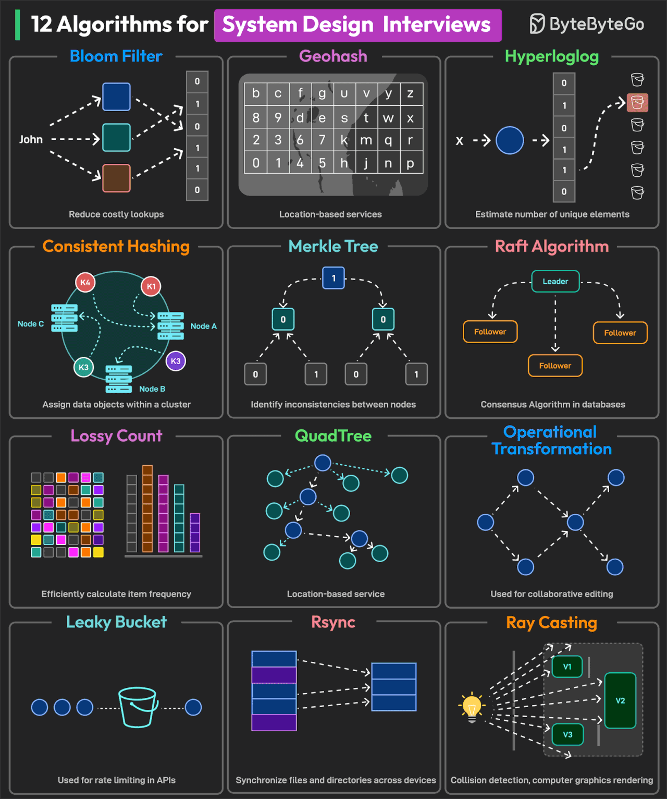

# System Design Notes

This repository contains notes, breakdowns, and practical examples on system design, covering key architectural patterns, scalable and fault-tolerant system design approaches, and trade-offs involved in architectural decisions.

## What’s Inside?
* **[Design Patterns](https://refactoring.guru/design-patterns)** (typical solutions to common problems in software design. Each pattern is like a blueprint that you can customize to solve a particular design problem in your code): 
  * **Creational Patterns** provide various object creation mechanisms, which increase flexibility and reuse of existing code:
    * **[Factory Method](https://refactoring.guru/design-patterns/factory-method)**
    * **[Abstract Factory](https://refactoring.guru/design-patterns/abstract-factory)**
    * **[Builder](https://refactoring.guru/design-patterns/builder)**
    * **[Prototype](https://refactoring.guru/design-patterns/prototype)**
    * **[Singleton](https://refactoring.guru/design-patterns/singleton)**
  * **Structural Patterns** explain how to assemble objects and classes into larger structures while keeping these structures flexible and efficient:
    * **[Adapter](https://refactoring.guru/design-patterns/adapter)**
    * **[Bridge](https://refactoring.guru/design-patterns/bridge)**
    * **[Composite](https://refactoring.guru/design-patterns/composite)**
    * **[Decorator](https://refactoring.guru/design-patterns/decorator)**
    * **[Facade](https://refactoring.guru/design-patterns/facade)**
    * **[Flyweight](https://refactoring.guru/design-patterns/flyweight)**
    * **[Proxy](https://refactoring.guru/design-patterns/proxy)**
  * **Behavioral Patterns** are concerned with algorithms and the assignment of responsibilities between objects:
    * **[Chain of Responsibility](https://refactoring.guru/design-patterns/chain-of-responsibility)**
    * **[Command](https://refactoring.guru/design-patterns/command)**
    * **[Iterator](https://refactoring.guru/design-patterns/iterator)**
    * **[Mediator](https://refactoring.guru/design-patterns/mediator)**
    * **[Memento](https://refactoring.guru/design-patterns/memento)**
    * **[Observer](https://refactoring.guru/design-patterns/observer)**
    * **[State](https://refactoring.guru/design-patterns/state)**
    * **[Strategy](https://refactoring.guru/design-patterns/strategy)**
    * **[Template Method](https://refactoring.guru/design-patterns/template-method)**
    * **[Visitor](https://refactoring.guru/design-patterns/visitor)**
* TBA
  
  * **Bloom Filter** (check if a requested item is in the cache before performing disk operations).
  * **Geohash** (used to build location-based services).
  * **HyperLogLog** (counting unique queries performed by users in a search).
  * **Consistent Hashing** (used for efficient data distribution between the cluster’s nodes).
  * **Merkle Tree** (used to detect inconsistencies between data replicas across multiple nodes).
  * **Raft Algorithm** (used to achieve consensus on log replication).
  * **Lossy Count** (network traffic analysis, web analytics, and identifying heavy hitters).
  * **QuadTree** (used to build location-based services).
  * **Operational** Transformation (used to support collaborative editing systems).
  * **Leaky Bucket** (used for rate limiting).
  * **Rsync** (synchronizing files and directories between two different systems).
  * **Ray Casting** (used for geospatial analysis, collision detection in video games, and computer graphics).

## Who is this for?
* Developers looking to deepen their understanding of large-scale system architecture.
* Candidates preparing for system design interviews.
* Architects and engineers designing scalable and resilient apps and systems.

---

P.S. This project is continuously updated with new materials and examples.
